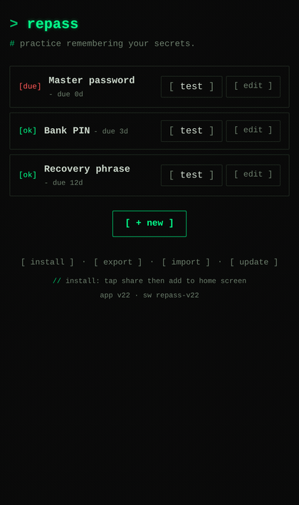
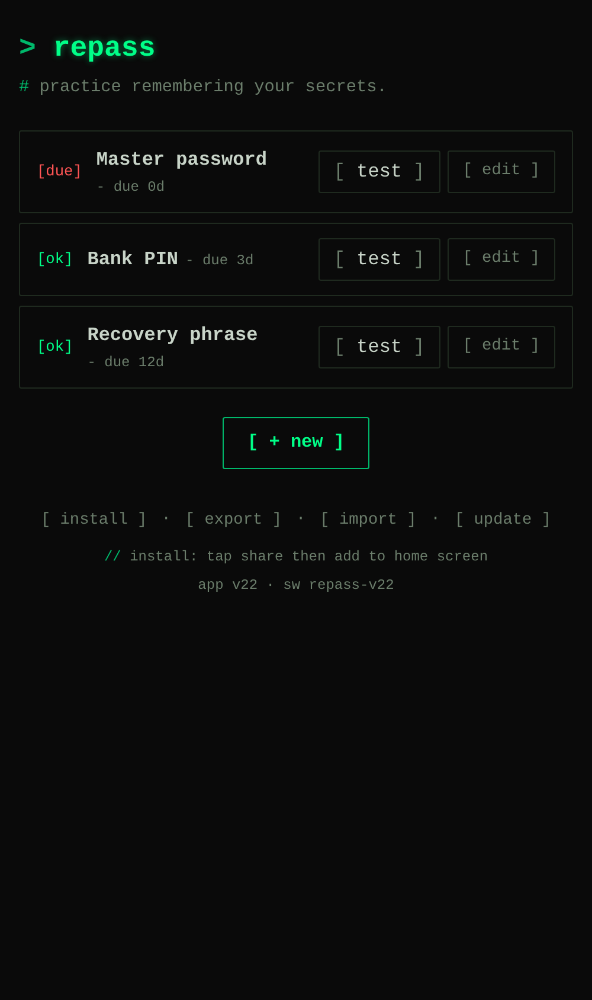
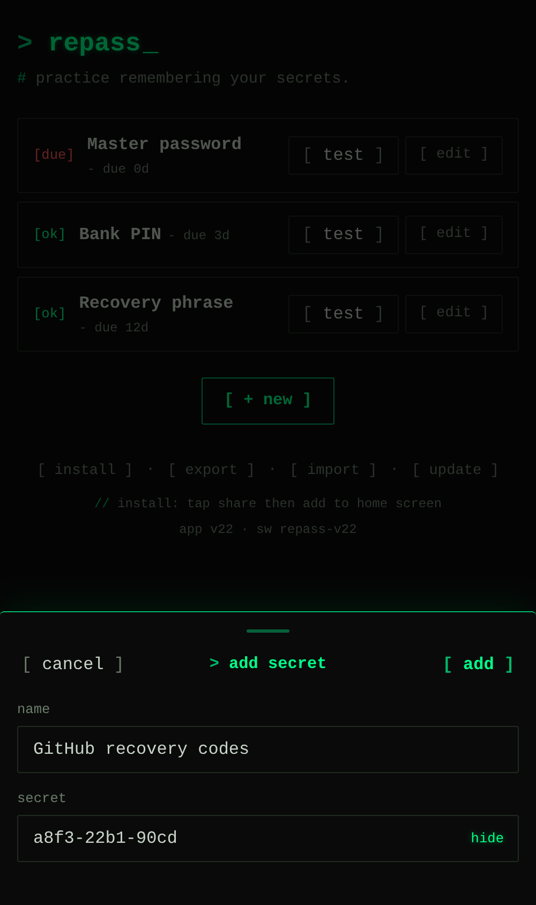
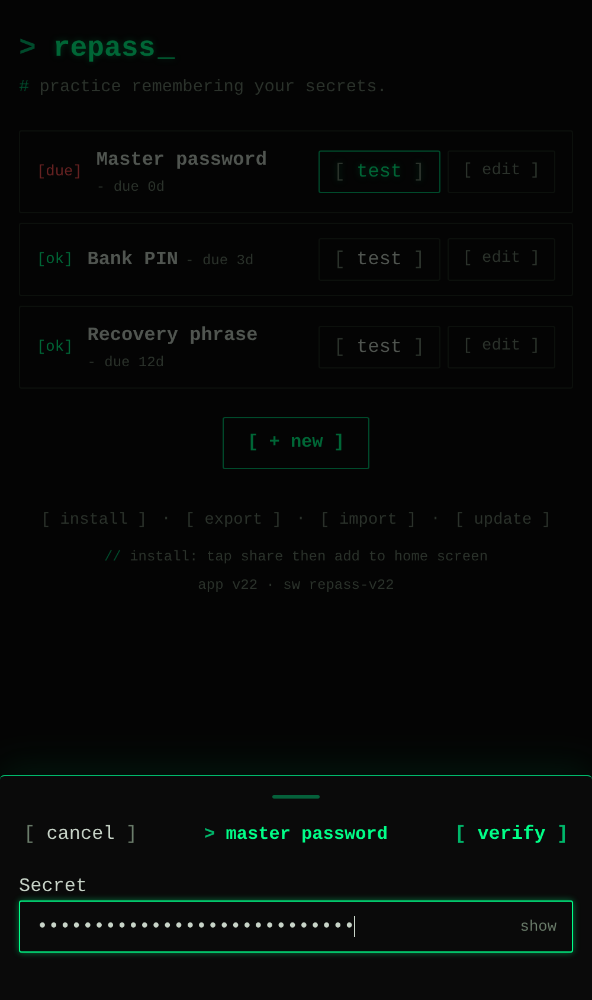
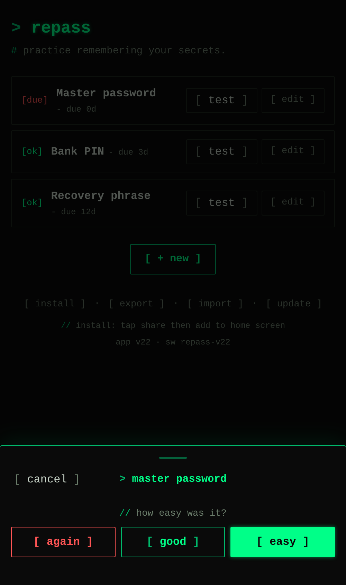

# RePass

A tiny webapp for practicing memorisation of secrets (passwords, recovery
phrases, PINs). It periodically asks you to re-enter a secret so you don't
forget the ones you rarely use.

No backend. No accounts. No network calls after first load.

## Demo

<p align="center">
  
</p>

A full pass: pick a due secret, type it from memory, verify against the
stored hash, then grade how easily it came back.

| Your secrets | Add one | Test recall | Grade it |
|:---:|:---:|:---:|:---:|
|  |  |  |  |

## How it works

When you add a secret:

1. A fresh 16-byte salt is generated with `crypto.getRandomValues`.
2. PBKDF2-SHA-256 at 600,000 iterations is run over `(secret, salt)`
   via `crypto.subtle.deriveBits`.
3. Only the **hash**, the **salt**, the **name**, the **scheduling
   state** (SM-2: `interval`, `efactor`, `reps`), and the **next-due
   date** are written to `localStorage`. The plaintext secret is never
   persisted.

When you tap **Test**, your input is hashed with the stored salt and
compared against the stored hash. On a successful match you grade
yourself — Again / Good / Easy — and the SM-2 algorithm computes a new
interval. A wrong input is not auto-graded; you can retry or close out
without affecting the schedule.

Because the salt is per-secret and random, identical secrets across
entries produce different hashes, and the stored data alone can't be
used to crack a secret without trying every candidate input.

See `docs/backup-format.md` for the SM-2 grading table and the full
data-model details.

## Install as a PWA on iOS

1. Open the site in Safari.
2. Share → **Add to Home Screen**.
3. Launch from the home-screen icon — it opens standalone and works
   offline (service worker caches the static files on first visit).

## Files

| File | Purpose |
|------|---------|
| `index.html` | Markup: add form, list, edit dialog |
| `style.css` | Mobile-first styling, auto light/dark |
| `script.js` | All app logic: storage, hashing, CRUD, render |
| `sw.js` | Service worker — caches static files for offline use |
| `manifest.webmanifest` | PWA metadata (name, icons, theme colour) |
| `icon-*.png` | Home-screen icons (180/192/512) |
| `docs/` | Design notes worth keeping (`docs/backup-format.md`, `docs/csp.md`) |
| `.github/workflows/pages.yml` | Deploys to GitHub Pages on push to `main` |

## Local development

The service worker requires HTTP (not `file://`), so serve the directory:

```sh
nix run nixpkgs#python3 -- -m http.server 8000
# or: npx serve .
```

Then open <http://localhost:8000>.

If you just want to test logic without the service worker, opening
`index.html` directly works too — the SW registration silently no-ops.

## When you edit cached files

The service worker serves cached copies, so edits to `index.html`,
`style.css`, `script.js`, or the icons won't reach installed users until
the cache is invalidated.

**Bump `const VERSION` in `sw.js`** (e.g. `'repass-v1'` → `'repass-v2'`)
whenever any cached file changes. On the next page load, the new SW
installs, the activate handler deletes the old cache, and clients pick
up the new files.

## Adding features

- **New CRUD or scheduling logic** → `script.js`. Keep it small and
  readable; this is the security-relevant code.
- **New UI elements** → `index.html` (markup) and `style.css` (styling).
- **New files that should work offline** → add them to the `FILES` array
  in `sw.js` *and* bump `VERSION`.

The data model lives in one place: the object pushed in `addSecret`. If
you add a field, also handle older stored entries that won't have it
(default it on read).

## Deployment

`.github/workflows/pages.yml` publishes the repo root to GitHub Pages on
every push to `main`. No build step — the files in the repo are exactly
what's served. Enable Pages once in repo Settings → Pages → Source:
*GitHub Actions*.

## What this app intentionally does not do

- Sync between devices (no backend).
- Recover a forgotten secret (only the hash is stored — by design).
- Show the secret back to you (same reason).
- Run any third-party code (no CDN, no fonts, no analytics).
